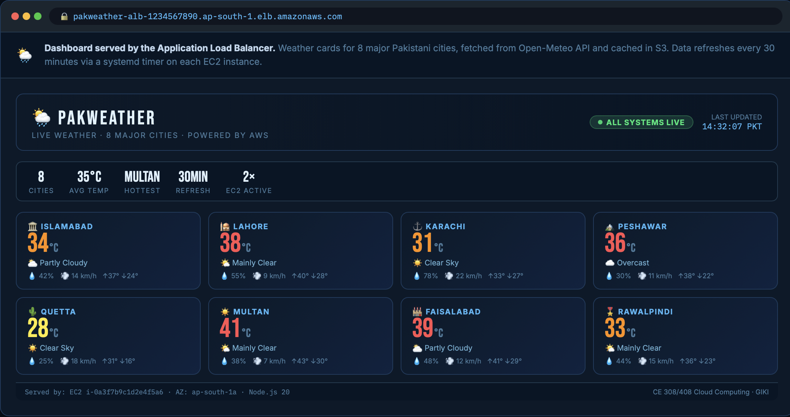
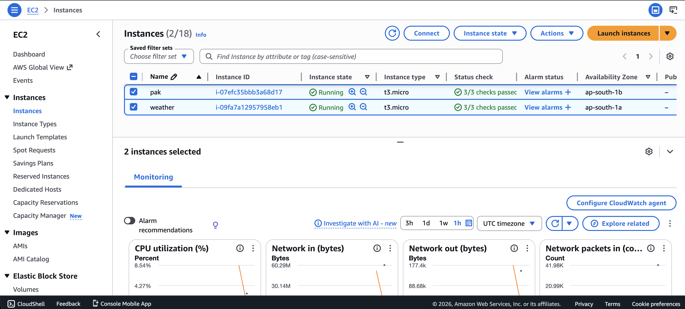
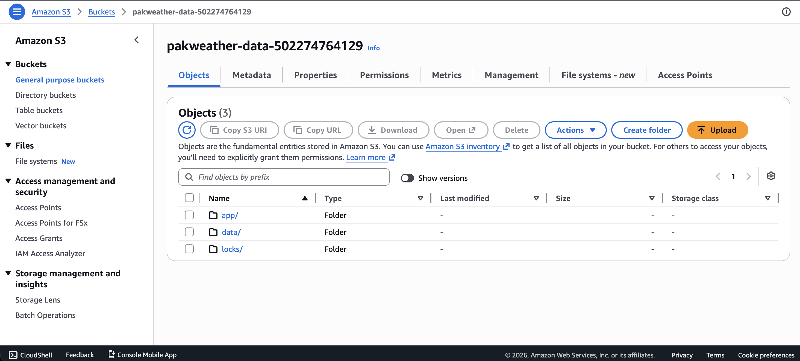

# PakWeather — Live Weather Dashboard on AWS

A highly available, fault-tolerant web application that displays **live weather conditions and 3-day forecasts for major Pakistani cities**, deployed on AWS using production-grade cloud architecture.

Data is sourced from the free [Open-Meteo API](https://open-meteo.com/) (no API key required).  
Cities covered: **Islamabad, Lahore, Karachi, Peshawar, Quetta, Multan, Faisalabad, Rawalpindi**

---

## 🟢 Live Deployment Screenshots

> The app is deployed and running on AWS `ap-south-1` (Mumbai). Screenshots below show the live system.

### Dashboard — Live Weather Cards



> 8 city weather cards served via Application Load Balancer. Data refreshes every 30 minutes from Open-Meteo API via a systemd timer on each EC2 instance.

---

### EC2 Instances — Both Healthy



> Two `t3.micro` instances running in **private subnets** across two Availability Zones (`ap-south-1a` and `ap-south-1b`). Both pass EC2 + ELB health checks.

---

### Target Group — 2/2 Targets Healthy


> ALB Target Group `pakweather-tg` with health check path `/health`. Both targets report **Healthy** status. The ALB stops routing to any instance that fails 3 consecutive checks.

---

### S3 Bucket — Weather Data Object



> `data/weather-latest.json` written by the background fetcher. S3 Versioning enabled, Block Public Access on, encrypted with SSE-S3. All EC2 traffic reaches S3 through the **VPC Gateway Endpoint** — never via public internet.

---

### Auto Scaling Group — Active


> ASG `pakweather-asg`: Desired **2**, Min **2**, Max **6**. Target tracking policy scales on CPU ≥ 50%. Instances launch into private subnets and register automatically with the target group.

---

### Health Endpoint — JSON Response


> `GET /health` returns `HTTP 200` with instance metadata. The ALB polls this every 15 seconds to determine routing eligibility.

---

## Architecture Overview

```
Internet
    │
    ▼
┌─────────────────────────────────────────────────────────┐
│  VPC: 10.0.0.0/16                                       │
│                                                         │
│  ┌──────────────────────────────────────────────────┐   │
│  │  Public Subnets (AZ-a + AZ-b)                    │   │
│  │                                                  │   │
│  │  ┌──────────────────────────────────────────┐    │   │
│  │  │   Application Load Balancer (alb-sg)     │    │   │
│  │  │   Internet-facing │ HTTP :80             │    │   │
│  │  └──────────────┬───────────────────────────┘    │   │
│  │                 │                                │   │
│  │  ┌──────────────┴───────────────────────────┐    │   │
│  │  │   NAT Gateway (outbound traffic)         │    │   │
│  │  └──────────────┬───────────────────────────┘    │   │
│  └─────────────────│──────────────────────────────┘ │
│                    │                                  │
│  ┌─────────────────▼──────────────────────────────┐  │
│  │  Private Subnets (AZ-a + AZ-b)                 │  │
│  │                                                 │  │
│  │  ┌─────────────────┐  ┌─────────────────┐      │  │
│  │  │ EC2 t3.micro     │  │ EC2 t3.micro     │      │  │
│  │  │ (app-sg)         │  │ (app-sg)         │      │  │
│  │  │ AZ-a             │  │ AZ-b             │      │  │
│  │  └────────┬─────────┘  └────────┬─────────┘      │  │
│  └───────────│───────────────────── │ ───────────────┘  │
└──────────────│─────────────────────── │ ─────────────────┘
               │                        │
               ▼                        ▼
         ┌─────────────────────────────────┐
         │  S3 Bucket (via VPC Endpoint)   │
         │  data/weather-latest.json       │
         │  locks/ingestion.lock           │
         └─────────────────────────────────┘
```

**AWS Services Used:**

| Service | Purpose |
| --- | --- |
| VPC | Network isolation with public + private subnets |
| EC2 (t3.micro × 2) | Application servers in private subnets |
| Application Load Balancer | Single public entry point, health-check routing |
| Auto Scaling Group | Fault tolerance, CPU-based horizontal scaling |
| S3 | Weather data storage + distributed lock |
| IAM Instance Role | Credential-free access (least privilege) |
| NAT Gateway | Outbound internet for private subnets |
| S3 VPC Gateway Endpoint | Private S3 traffic (never traverses public internet) |
| Session Manager (SSM) | Secure instance access without SSH |

---

## Prerequisites

1. **An AWS account** (new accounts receive $100 in free credits)
2. **AWS region** — this guide uses `ap-south-1` (Mumbai); adjust if preferred
3. **No external API key needed** — Open-Meteo is free and open

---

## Deployment Guide

### 1. Create the S3 Bucket

Go to **S3 → Create bucket**:

- **Name:** `pakweather-data-<your-12-digit-account-id>` *(Find your account ID in the top-right corner of the AWS console)*
- **Region:** `ap-south-1`
- **Block Public Access:** ✅ all four boxes ticked
- **Versioning:** ✅ Enabled
- **Encryption:** SSE-S3 (AES-256) — enabled by default

After creating the bucket, apply the bucket policy:

1. Go to the bucket → **Permissions** tab → **Bucket policy**
2. Paste the contents of `policies/s3-bucket-policy.json`
3. Replace `ACCOUNTID` with your actual account ID
4. Click **Save changes**

---

### 2. Build the VPC

Go to **VPC → Create VPC → "VPC and more"** (the wizard):

| Setting | Value |
| --- | --- |
| Name tag | `pakweather` |
| IPv4 CIDR | `10.0.0.0/16` |
| Availability Zones | **2** |
| Public subnets | **2** (one per AZ) |
| Private subnets | **2** (one per AZ) |
| NAT Gateways | **1 (in 1 AZ)** — saves cost for an assignment |
| S3 Gateway Endpoint | ✅ **Enabled** |

Click **Create VPC** and wait ~2 minutes.

---

### 3. Create the IAM Role

Go to **IAM → Roles → Create role**:

**Step 1 — Trusted entity:**
- Trusted entity type: **AWS service**
- Use case: **EC2**
- Click Next

**Step 2 — Add permissions:**
- Search and attach: `AmazonSSMManagedEC2InstanceDefaultPolicy` (AWS managed — enables Session Manager)
- Click Next

**Step 3 — Name and create:**
- Role name: `PakWeatherAppRole`
- Click **Create role**

**Step 4 — Add inline policy:**
1. Click into the newly created role
2. Go to **Permissions** → **Add permissions** → **Create inline policy**
3. Switch to the **JSON** tab
4. Paste contents of `policies/iam-role-policy.json`
5. Replace `ACCOUNTID` with your actual account ID
6. Name the policy: `PakWeatherAppPolicy`
7. Click **Create policy**

---

### 4. Create Security Groups

Go to **VPC → Security Groups → Create security group** (create two):

**Security Group 1 — `pakweather-alb-sg`**
- VPC: `pakweather`
- Inbound rules:
  - HTTP (port 80) from `0.0.0.0/0`
  - HTTPS (port 443) from `0.0.0.0/0`
- Outbound: All traffic to `0.0.0.0/0`

**Security Group 2 — `pakweather-app-sg`**
- VPC: `pakweather`
- Inbound rules:
  - HTTP (port 80) — **Source: `pakweather-alb-sg`** (select the SG ID, not `0.0.0.0/0`)
- Outbound: All traffic to `0.0.0.0/0`

> ⚠️ The outbound **all traffic** rule on `pakweather-app-sg` is critical — instances must reach the NAT Gateway to call Open-Meteo and AWS APIs.

---

### 5. Create the Launch Template

Go to **EC2 → Launch Templates → Create launch template**:

| Setting | Value |
| --- | --- |
| Name | `pakweather-template` |
| AMI | Amazon Linux 2023 (search in Quick Start, choose 64-bit x86) |
| Instance type | `t3.micro` |
| Key pair | None (we use Session Manager) |
| Security group | `pakweather-app-sg` |
| IAM instance profile | `PakWeatherAppRole` |

Scroll down to **Advanced details → User data**:
1. Open the file `user-data.sh` from this repository
2. Find the line: `S3_BUCKET="pakweather-data-ACCOUNTID"`
3. Replace `ACCOUNTID` with your actual AWS account ID
4. Paste the entire modified script into the User data field

Click **Create launch template**.

---

### 6. Create the Application Load Balancer

**Step A — Create Target Group first:**

Go to **EC2 → Target Groups → Create target group**:

| Setting | Value |
| --- | --- |
| Target type | Instances |
| Name | `pakweather-tg` |
| Protocol | HTTP |
| Port | 80 |
| VPC | `pakweather` |
| Health check path | `/health` |
| Healthy threshold | 2 |
| Unhealthy threshold | 3 |
| Timeout | 5 seconds |
| Interval | 15 seconds |

Click **Next → Create target group** (no manual instance registration needed — the ASG handles this).

**Step B — Create the ALB:**

Go to **EC2 → Load Balancers → Create load balancer → Application Load Balancer**:

| Setting | Value |
| --- | --- |
| Name | `pakweather-alb` |
| Scheme | Internet-facing |
| IP address type | IPv4 |
| VPC | `pakweather` |
| Subnets | Both **public** subnets (one per AZ) |
| Security group | `pakweather-alb-sg` |

Under **Listeners and routing:**
- Protocol: HTTP, Port: 80
- Default action: Forward to → `pakweather-tg`

Click **Create load balancer**.

---

### 7. Create the Auto Scaling Group

Go to **EC2 → Auto Scaling Groups → Create Auto Scaling group**:

**Step 1 — Name and template:**
- Name: `pakweather-asg`
- Launch template: `pakweather-template`

**Step 2 — Instance launch options:**
- VPC: `pakweather`
- Availability Zones: both **private** subnets (one per AZ)

**Step 3 — Load balancing:**
- Attach to an existing load balancer
- Choose from your load balancer target groups: `pakweather-tg`
- Health check type: **EC2** + **ELB** (tick both)
- Health check grace period: **120 seconds**

**Step 4 — Group size and scaling:**

| Setting | Value |
| --- | --- |
| Desired capacity | 2 |
| Minimum capacity | 2 |
| Maximum capacity | 6 |

Scaling policy:
- Type: Target tracking scaling
- Metric: Average CPU utilization
- Target value: **50%**

Click through → **Create Auto Scaling group**.

---

### 8. Verify Deployment

Wait **3–5 minutes** for instances to boot and run the setup script.

1. Go to **EC2 → Target Groups → `pakweather-tg`**  
   → Both targets should show **Healthy** status

2. Go to **EC2 → Load Balancers → `pakweather-alb`**  
   → Copy the **DNS name** (e.g. `pakweather-alb-xxxxxxxxx.ap-south-1.elb.amazonaws.com`)

3. Open the DNS name in a browser  
   → You should see the PakWeather dashboard with live weather cards for 8 cities

---

## How It Works

### Request Lifecycle (User-Facing)

```
Browser
  │
  ▼  HTTP GET /
Application Load Balancer
  │  picks a healthy EC2 instance (round-robin)
  ▼
EC2 Instance (Node.js server.js)
  │  checks in-memory cache (TTL: 2 minutes)
  │  if cache miss → reads data/weather-latest.json from S3
  ▼
HTML Response
  │  renders weather cards for all 8 cities
  ▼
Browser displays PakWeather dashboard
```

### Background Fetch Lifecycle

```
systemd timer (every 30 minutes, per instance)
  │
  ▼
pakweather-fetch.js starts
  │
  ├─ Checks s3://bucket/locks/ingestion.lock
  │   └─ Lock exists?  → EXIT (another instance is fetching)
  │   └─ Lock absent?  → Create lock file (acquire)
  │
  ▼
Fetch weather for 8 cities in parallel
  │  calls api.open-meteo.com (outbound via NAT Gateway)
  │  normalizes response to PakWeather schema
  ▼
Write s3://bucket/data/weather-latest.json
  │
  ▼
Delete lock file (release)
  │
  ▼
Other instances pick up new data within 2 minutes (cache TTL)
```

### Concurrency Control

The S3 lock file (`locks/ingestion.lock`) prevents multiple EC2 instances from hammering the Open-Meteo API simultaneously. The lock is cooperative — best-effort is sufficient for a 30-minute cycle. If an instance crashes mid-fetch, the lock will expire on the next cycle when the losing instances see no lock and retry.

---

## Security

Defense in depth across four layers:

### Network Layer
- EC2 instances run in **private subnets** — no public IP addresses
- Security groups are **deny-by-default**; only the ALB can reach port 80 on instances
- The ALB is the **only public ingress** point
- All S3 traffic flows through a **VPC Gateway Endpoint** — never traverses the public internet

### Identity Layer
- **No static AWS credentials** on instances — IAM Instance Role only
- **Least-privilege IAM policy:** instances can only access two S3 prefixes (`data/` and `locks/`) on the specific bucket
- **Session Manager replaces SSH** — port 22 is never opened anywhere

### Data Layer
- S3 **Block Public Access** enabled (all four settings)
- S3 **default encryption:** SSE-S3 (AES-256)
- **Bucket policy** denies any non-TLS request (see `policies/s3-bucket-policy.json`)
- S3 **versioning enabled** — recovers from accidental overwrites

### Application Layer
- Open-Meteo API is public and free — no credentials to manage
- All AWS SDK calls use temporary credentials from the Instance Role
- No credentials, secrets, or API keys are stored in source code, AMIs, or environment variables baked into images

---

## Fault Tolerance

| Failure Scenario | System Behavior |
| --- | --- |
| One EC2 instance crashes | ALB health check detects unhealthy → stops routing to it → ASG launches a replacement in the same AZ |
| Entire Availability Zone goes offline | ALB routes only to the surviving AZ → ASG launches replacement instances there |
| Open-Meteo API is unreachable | Background fetch fails gracefully; app continues serving the **last successful data** from S3 |
| S3 is temporarily unavailable | Server uses **in-memory cache** (2-minute TTL) to continue serving requests |
| Bad deployment pushed | ASG instance refresh rolls back if new instances fail health checks within the grace period |
| Instance compromised | Blast radius limited to `data/` and `locks/` prefixes on one bucket — IAM least privilege prevents lateral movement |

---

## Cost Estimate

Approximate monthly cost in Mumbai (`ap-south-1`), on-demand pricing:

| Component | Monthly Cost |
| --- | --- |
| 2× t3.micro EC2 (24/7) | ~$8 |
| Application Load Balancer | ~$18 |
| 1× NAT Gateway | ~$32 |
| S3 storage + requests (minimal) | < $1 |
| **Total** | **~$60/month** |

> 💡 New AWS accounts get **$100 in free credits**. A one-week assignment deployment with active testing typically consumes **$15–25** of credits.

---

## Teardown

Delete resources in this exact order to avoid dependency errors:

1. **Auto Scaling Group** → Actions → Delete
2. **Load Balancer** (`pakweather-alb`) → Actions → Delete
3. **Target Group** (`pakweather-tg`) → Actions → Delete
4. **Launch Template** → Actions → Delete
5. **NAT Gateway** → Actions → Delete *(wait 2 minutes for it to detach)*
6. **Elastic IPs** → VPC console → Elastic IPs → Release all addresses
7. **S3 bucket** → Empty bucket first → then Delete bucket
8. **VPC** (`pakweather`) → Actions → Delete VPC *(this also deletes subnets, route tables, IGW)*
9. **IAM role** (`PakWeatherAppRole`) → Delete (optional)

---

## Troubleshooting

### Targets stuck in "Unhealthy"

1. Confirm `pakweather-app-sg` inbound allows HTTP (port 80) **from `pakweather-alb-sg`** (not from `0.0.0.0/0`)
2. Confirm `pakweather-app-sg` outbound allows **all traffic** to `0.0.0.0/0`
3. Connect to an instance via **Session Manager** and run:

```bash
sudo systemctl status pakweather.service
sudo journalctl -u pakweather.service -n 50
sudo cat /var/log/pakweather-setup.log
```

### Session Manager button is grey / "SSM Agent unable to acquire credentials"

The instance cannot reach the internet. Check:
1. The NAT Gateway status is **Available** and is in a **public** subnet
2. Both **private** route tables have a route: `0.0.0.0/0 → nat-xxxxxxxx`
3. `pakweather-app-sg` outbound allows all traffic to `0.0.0.0/0`

### Dashboard shows "Weather data not loaded yet"

1. Wait 1–2 minutes for the boot-time fetch to complete
2. Connect via Session Manager and run:

```bash
sudo journalctl -u pakweather-fetch.service -n 50
```

3. Verify the S3 bucket name in the systemd unit matches your actual bucket:

```bash
sudo systemctl cat pakweather-fetch.service
```

4. Manually trigger a fetch:

```bash
sudo systemctl start pakweather-fetch.service
sudo journalctl -u pakweather-fetch.service -f
```

### Auto Scaling Group keeps launching and terminating instances

This means health checks are continuously failing. Check:
1. The target group is attached to the ASG (ASG → **Integrations** tab)
2. The health check grace period is at least **120 seconds** (the boot script needs time)
3. `pakweather-app-sg` inbound allows port 80 from `pakweather-alb-sg`

---

## Repository Structure

```
pakweather/
├── app/
│   ├── server.js              # Node.js web server (serves weather dashboard)
│   └── pakweather-fetch.js    # Background fetcher (runs via systemd timer)
├── policies/
│   ├── iam-role-policy.json   # Least-privilege IAM inline policy
│   └── s3-bucket-policy.json  # S3 bucket policy (TLS-only)
├── screenshots/               # Live deployment screenshots
│   ├── dashboard.png
│   ├── ec2-instances.png
│   ├── target-group.png
│   ├── s3-bucket.png
│   ├── asg.png
│   └── health-endpoint.png
├── user-data.sh               # EC2 bootstrap script (paste into Launch Template)
└── README.md                  # This file
```

---

## Author

Submitted as part of the **CE 308/408 Cloud Computing** course at **GIKI**.

## License

This project is for academic purposes.
